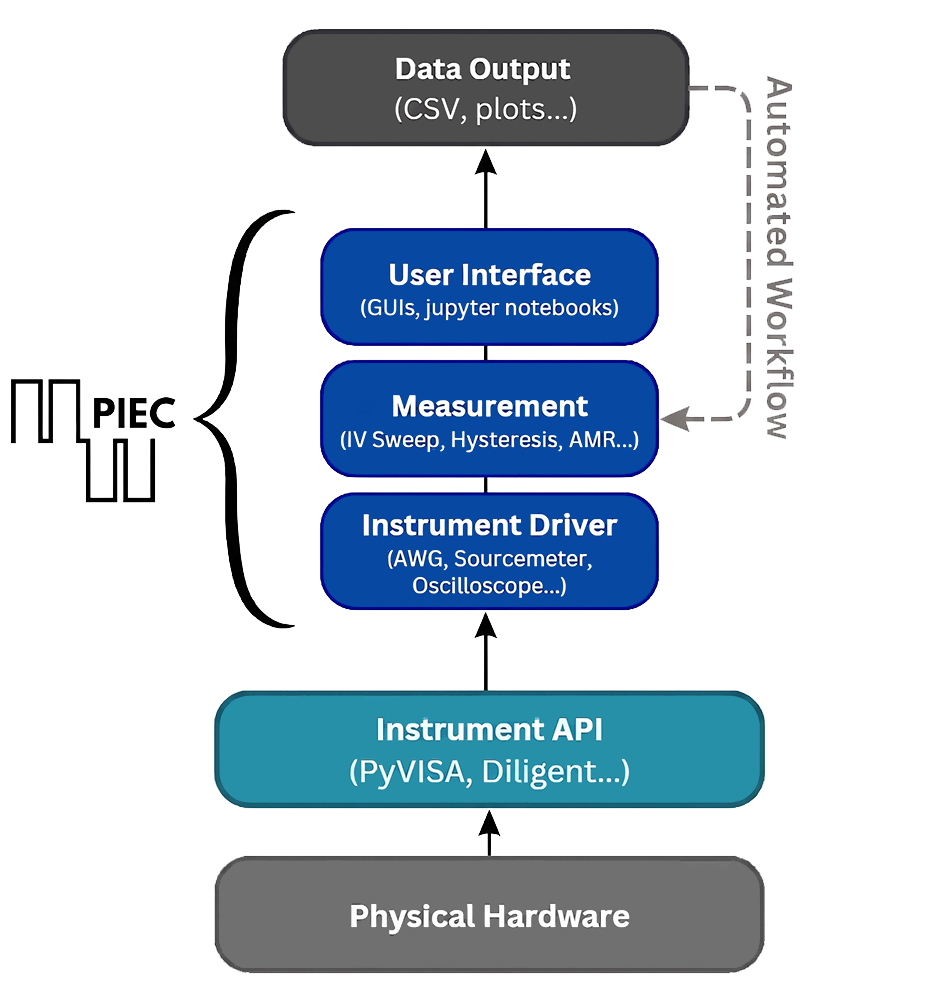

What is PIEC?
=============

**PIEC (Python Integrated Experimental Control)** is a Python library for streamlining 
deployment of experimental workflows and supporting development of new experimental procedures
through a robust, object-oriented framework. It was designed to support multiple levels of entry.
Almost no coding knowledge is required to set up pre-established experimental workflows, but the 
framework can also serve as a foundation for more complex experimental designs.

PIEC provides:

* **GUIs and notebooks** — graphical interfaces and Jupyter notebook examples for interactive
  use without writing code from scratch.
* **Measurement classes** — ready-to-use experiment types (hysteresis loops, PUND, AMR, IV
  sweeps) that handle instrument configuration, data acquisition, and saving automatically.
* **Instrument drivers** — a unified interface for communicating with real hardware (AWGs,
  oscilloscopes, DMMs, lock-in amplifiers, and more) over GPIB, USB, and other connections.

Who is PIEC for?
----------------
PIEC is aimed at experimental scientists and engineers who:

* Work with programmable lab instruments.
* Want to quickly set up and run pre-established experimental workflows.
* Want to automate measurements and reduce manual data collection.
* Need a robust and flexible starting point they can extend for custom experiments.

How PIEC fits into your workflow
---------------------------------
A typical, no-coding required PIEC workflow looks like this:

1. Run ``pip install piec`` on a computer with Python installed.
2. Download the desired experiment GUI program form the ``Measurements`` module.
3. Make sure you have the supported instruments of the correct type connected to your computer.
4. Run ``python <experiment_script>_gui.py`` to execute the experiment.

A typical, code-based PIEC workflow looks like this:

1. Connect to your instruments using a driver from ``piec.drivers``.
2. Create a measurement object from ``piec.measurement`` with your desired experimental parameters.
3. Call ``run_experiment()`` — piec handles instrument configuration, waveform output, data
   capture, and saving.
4. Inspect and analyze the output data, script automated workflows, etc.

For a hands-on introduction, see :doc:`quickstart`.