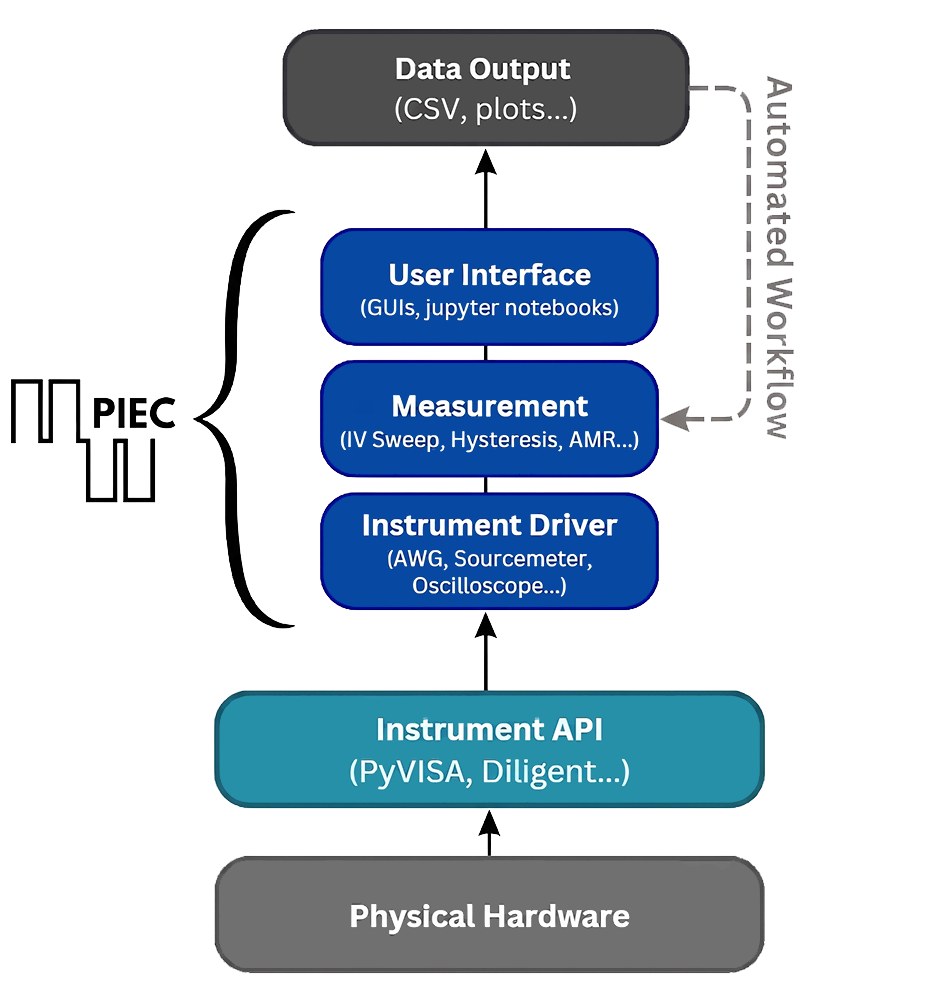
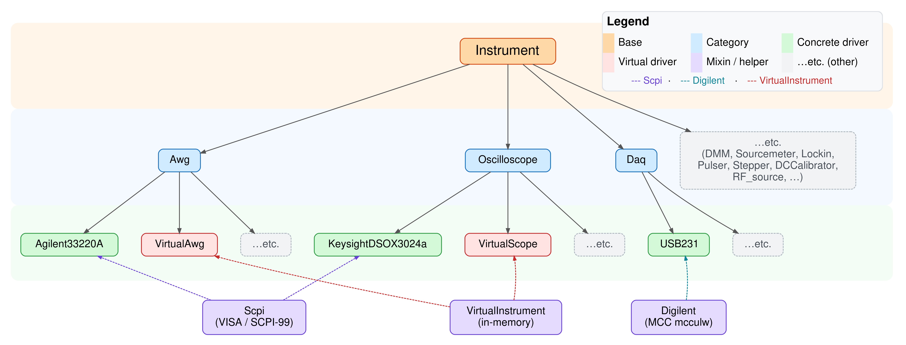

# Summary

Experimental laboratories depend on the precise, coordinated control of myriad instruments from complex waveform generators, oscilloscopes, or amplifiers, to simple motors or magnetic coils. Any automatable experimental procedure can be decomposed into communications with individual instruments, scripting that synchronizes instrument behavior, and data collection and processing. `PIEC` (Python Integrated Experimental Control) is an open-source Python library that provides the infrastructure for such experiment design and operation through a hierarchical, object-oriented framework with enforced standards via templates at the instrument driver level, and points of entry at multiple levels of technical depth. Originally developed at Brown University as a fork of the ferroelectric testing-focused `EKPY` python suite [@Parsonnet_ekpy], `PIEC` is designed to be extended to any experimental domain that requires programmable instrument control. The standardized, hierarchical abstraction in PIEC also naturally enables integration with AI/ML-driven workflows, where experiments can be programmatically defined, executed, and iteratively refined by external optimization or decision-making agents. This positions `PIEC` as a backend for autonomous or semi-autonomous laboratory systems. It is installable via `pip install piec` and its documentation is hosted at [https://piec.readthedocs.io](https://piec.readthedocs.io).

# Statement of Need

‘PIEC’ is a versatile platform for experimentalists seeking to automate laboratory instruments, serving users from professional scientists and engineers to students encountering these tools for the first time. Currently, setting up an experiment often requires users either to build automation workflows from scratch or to purchase proprietary, ‘black-box’ test systems with closed-source software. `PIEC`'s API is designed to circumvent these limitations and provide a class-based, user-friendly interface for common experimental operations, such as waveform generation, data acquisition, and synchronized multi-instrument triggering. The package seeks to be a collaborative central repository where researchers can design and build experiments and share their work, collectively saving tedious ramp up time for new laboratory setups. `PIEC` relies on and interfaces naturally with the standard scientific Python stack, using NumPy, SciPy, Matplotlib, and pandas for data handling and visualization.

The common measurement workflow of a ferroelectric hysteresis loop highlights the instrumentation challenges that motivated `PIEC`: to measure a polarization–electric field hysteresis loop, a researcher must configure an arbitrary waveform generator (AWG) to output a specific triangular voltage waveform, trigger an oscilloscope to capture the resulting displacement current, and integrate the current to recover the polarization, all before a single data point is recorded. Inconsistencies in communication protocols and in the structure of other open-source instrument drivers mean that a researcher setting up such a measurement would typically build a system from the ground-up based on available hardware, navigating multiple repositories and repeating work done by many others before. Alternatively, the researcher could purchase a small number of off-the-shelf ferroelectric testing solutions that exist on the market, though by virtue of the profit model, these packages severely lack in customization, transparency in circuit/software design, are significantly marked up over base hardware costs, and may contain functions which go unused for the researcher’s specific needs, only inflating cost and complexity.

`PIEC` is designed to allow researchers to automate such full-stack instrumentation to data generation experiment pipelines, or for time-constrained researchers to simply download the repository, source the hardware that meets their specific needs, and immediately program experiments and acquire data using a pre-built GUI or Jupyter Notebook. The combination of validated and standardized instrument drivers, reusable `Measurement` classes, a range of convenience functionalities such as file system handling and virtual instruments for offline testing in `PIEC` allows the researcher to choose exactly where on the spectrum of customization they want to enter the experimental design process. Beyond manual use, this modular structure enables closed-loop experimentation, where measurement routines can be dynamically generated and updated by machine learning models or optimization algorithms. By exposing a consistent API across instruments and experiments, PIEC reduces the engineering overhead required to integrate laboratory hardware into AI-driven discovery pipelines. 

# State of the Field

The landscape of laboratory automation is dominated by commercial platforms such as LabVIEW [@LabVIEW], which are widely deployed across experimental laboratories. While powerful, these solutions rely on proprietary programming environments and require licenses, making them cost-restrictive, inflexible, and difficult to integrate with modern version-control and custom automated workflows.

In the open-source ecosystem, several Python-based tools have emerged to address these limitations. General-purpose packages like PyMeasure [@PyMeasure_Developers_PyMeasure] and QCoDeS [@qcodes] provide extensive libraries of instrument wrappers, parameter validation, and sweep automation. Within specific subfields, targeted packages such as Hardware-Control [@Giesbrecht2022] and EKPY [@Parsonnet_ekpy] have been developed to handle automated testing and analysis for specific instrumentation, focusing on beamline and ferroelectric measurements respectively.

PIEC is developed to bridge the gap between generalized instrument wrappers and highly specialized, rigid test suites. It is a valuable alternative to the options listed above because of three major differences in design:

First and foremost, `PIEC` employs a "type-first" architecture, where the native instrument drivers are organized by general, abstracted instrument functionality, rather than specific API families. Existing solutions like PyMeasure [@PyMeasure_Developers_PyMeasure] typically build drivers around specific instrument models, which can make substituting hardware within an experimental setup cumbersome. In contrast, `PIEC` is designed around rigid driver class definitions built from abstract templates. These templates enforce a standard interface across any instrument of a given type (e.g., any arbitrary waveform generator or oscilloscope must possess the same core methods). Though this type-first approach may require extra effort to expose unique features of a specific model, it allows a standardized, hardware-agnostic measurement stack to be built on top of the drivers. Another potential drawback is increased coding overhead stemming from lack of reliance on repeated API calls across instruments. We attempt to mitigate this detriment by providing additional parent classes for common APIs such as SCPI and Digilent, and also by prioritizing ease of use with modern LLM coding assistants.

Second, `PIEC` prioritizes minimizing overhead for researchers who want to get new experimental flows up and running quickly and simply. While other open-source repositories like QCoDeS [@qcodes] provide excellent frameworks to script experimental setups, and can act as robust control and data handling backbones to a laboratory setup, the depth of features can make initial setup and rapid prototyping cumbersome. The hierarchical structure of `PIEC` allows researchers to deploy complex experiments quickly, with little to no Python knowledge.

Third, while existing frameworks provide robust scripting environments, they are not explicitly designed for seamless integration with modern AI/ML pipelines. PIEC’s type-consistent interfaces and modular measurement abstractions make it particularly well-suited for use in autonomous or AI-driven experimentation, where reproducibility, composability, and machine-readable structure are critical.

# Software Design

The main principle behind `PIEC`'s instrument control design is to provide a user-friendly API that researchers can use to ensure continuity between different instrument manufacturers and experimental setups. The instrument drivers are designed with a “type-first” philosophy, and can be understood as having three layers of abstraction.

{width="40%"}

Within `piec.drivers`, the base `Instrument` class (Level 1) is a parent class which defines the minimum requirements of any instrument driver in general, wrapping PyVISA [@pyvisa] for resource management. The `Scpi` child class optionally extends this with vetted implementations for Standard Commands for Programmable Instruments (SCPI)-compliant devices [@scpi1999spec]. Driver classes (Level 2) — such as `Oscilloscope`, `Awg`, `lockin`—define the required methods and parameter standards for the drivers to implement. Specific instrument models (Level 3) inherit from these classes and implement the hardware-specific logic. Each instrument category also provides a `VirtualInstrument` that returns simulated responses, enabling development and testing without physical hardware.

On top of this three-level standardized instrument control, within `piec.measurement` we provide `Measurement` classes that coordinate multiple drivers to implement complete experiment protocols. For example, `HysteresisLoop` configures an AWG to output a triangular voltage waveform, triggers an oscilloscope to capture applied voltage and displacement current, integrates the current to compute polarization, and saves the P-E loop to a structured file, all in a single method call. Each `Measurement` class initializes using instrument objects that match the required instrument types for the particular measurement. It then calls functions from the instrument objects to produce the correct calls to the hardware. Further analysis methods in the `Measurement` class process the data, save data files in a standard ‘.csv’ format along with added metadata. The format consists of a metadata table with an arbitrary number of rows and one column at the top of the file, followed by a data table with an arbitrary number of rows and columns. This choice was made to provide human readability and ease of use, while maintaining a structured, machine-readable architecture required for automated analysis.

Finally, in the top-level Measurement repository, GUIs are provided using a class in ‘piec.measurement.gui_utils.py’ which leverages tkinter and Matplotlib [@hunter2007matplotlib], as well as python notebooks where the measurement and driver classes can be run directly. Useful background on measurements is included in the notebooks as well as markdown files in the same directory.

The layered architecture means that a researcher can work at whatever level their experiment requires, whether that is coding driver methods for new setups, creating `Measurement` classes for running experiments, or using the pre-existing graphical interfaces for routine tasks without writing code. Standard Python packages such as NumPy [@harris2020array], and Pandas [@the_pandas_development_team_2026_19340003] are used throughout the workflow.

In the case that an instrument isn't supported or a new measurement class is needed, extending `PIEC` only requires implementing a driver subclass alongside its `VirtualInstrument`, or adding a new experiment type requires implementing a `Measurement` subclass, respectively, without modifying other existing code.

The structured, template-driven design also enables robust integration with modern AI-assisted workflows. The directory for each instrument type contains a template class which contains every method and attribute, as well as detailed docstrings, but no implementation. Entirely new instruments can be quickly and seamlessly integrated into the codebase by providing the existing `example` driver template and the corresponding `DRIVER_DEVOLPMENT_GUIDE` as context to an LLM, and then manually stepping through provided debugging notebooks.

# Research Impact Statement

`PIEC` has been developed and applied in the School of Engineering at Brown University, based on software developed at UC Berkeley to support experimental research on ferroelectric thin films and correlated oxide materials [@ghosal2026], [@fratian2026]. The repository is currently deployed at Brown to perform charge and magneto-transport characterization of thin film complex oxides. It is also deployed at UC Berkeley to evaluate fatigue behavior of ferroelectric films grown with CMOS-compatible workflows. Further projects plan to extend use of the repository to solid state electrolyte testing, and a range of heat and motor control instruments which could extend its use to biological labs, robotics, and more.

`PIEC` lowers the barrier to building, modifying, and sharing automated experimental workflows by providing a standardized, open, and extensible interface for laboratory instrumentation. By abstracting hardware into consistent, type-defined components and encapsulating experimental procedures into reusable measurement classes, the software enables researchers to rapidly prototype and deploy complex experiments without rebuilding control infrastructure from scratch.
This approach has immediate impact for experimental research groups, where time and resources are often constrained by fragmented software ecosystems and instrument-specific code. PIEC allows laboratories to redirect effort away from low-level integration and toward scientific questions, while improving reproducibility through structured data handling and standardized workflows.

Importantly, `PIEC` also provides a foundation for emerging paradigms in automated and autonomous experimentation. Its consistent API and composable architecture allow direct integration with optimization algorithms, machine learning models, and AI agents that can design, execute, and analyze experiments in closed-loop workflows. Thus, not only does `PIEC` provide a rapid, easily-integrable test workflow for experimenters of all levels, it also serves as a bridge between physical laboratory systems and data-driven discovery methods, supporting the development of scalable, self-driving laboratories. The authors encourage feedback and discussion about the repository either through posts the issues tab on our GitHub page or through direct contact via email.

# AI Usage Disclosure

Portions of the source code and documentation were developed with assistance from generative AI tools including Google Gemini, GitHub Copilot, and Anthropic Claude products. All AI-generated content was manually reviewed, tested, and modified by the authors prior to inclusion in the repository.

# Acknowledgements

The authors would like to acknowledge inspiration from the efforts of Eric Parsonnet at UC Berkeley, followed by Neal Reynolds at Kepler Computing Inc. in their development of software tools that thoughtfully prioritized user needs in a laboratory setting. We also acknowledge funding from the Brown University Undergraduate Teaching and Research Award (UTRA), which enabled Jesalina Phan and Rohan Pankaj to make their valuable contributions. Ferroic test and evaluation software development was supported by the Air Force Office of Scientific Research under AFOSR FA9550-24-1-0169.